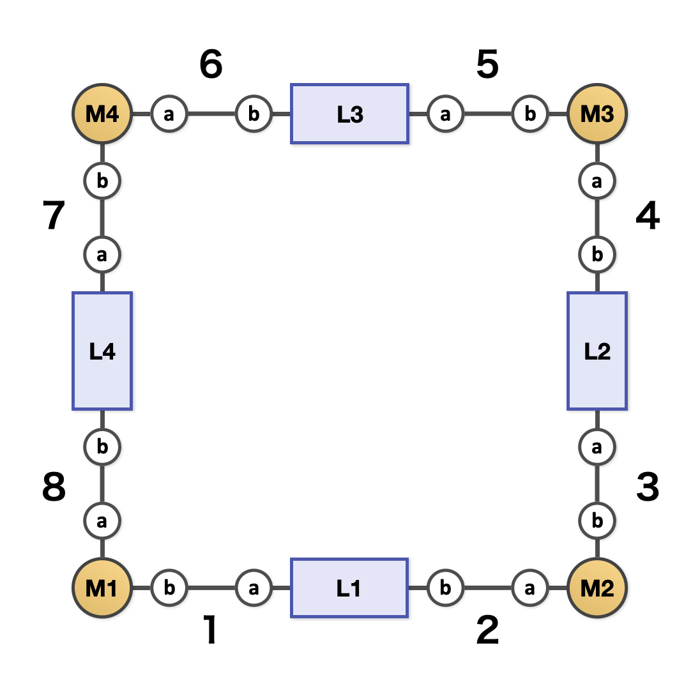

Use M4L4 assembly as an example, where M is a metal ion with two binding sites and L is a ditopic ligand with two binding sites.

{ width=480px }
/// caption
Example IDs for the bonds, components, and binding sites
///