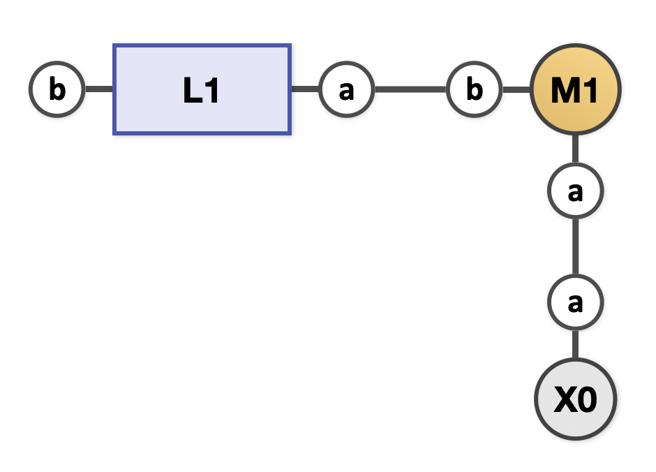

# Output File


## Example

--8<-- "about-example.h.md"


``` yaml title="output.yaml"
--8<-- "assets.h/output.yaml"
```

## Explanation

``` yaml
0: !Assembly
  bonds:
  - [L1.a, M1.b]
  - [M1.a, X0.a]
  comp_id_to_kind: {L1: L, M1: M, X0: X}
```

Each assembly is represented as a dictionary with the following fields:

- `bonds`: A list of binding site pairs.
- `comp_id_to_kind`: A dictionary where keys are component IDs and values are component kinds.

In the example above, the assembly has three components, `L1`, `M1`, and `X0`, whose kinds are `L`, `M`, and `X`, respectively. The assembly has two bonds: one between the binding sites `a` of `L1` and `b` of `M1`, and another between the binding sites `a` of `M1` and `a` of `X0`.

{ width=480px }
/// caption
Structure of the assembly-0, i.e., MLX
///